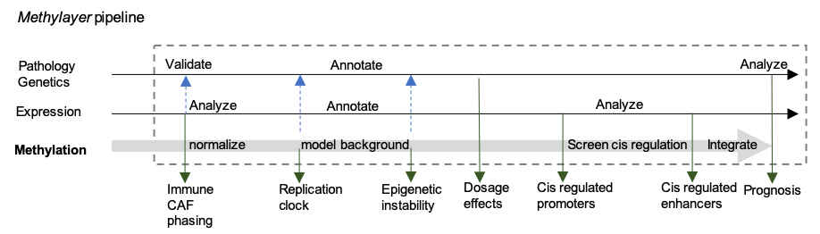

<!-- README.md is generated from README.Rmd. Please edit that file -->
# methylayer

<!-- badges: start -->
[](https://www.tidyverse.org/lifecycle/#experimental) <!-- badges: end -->

A major challenge in the understanding of tumor methylation is the convergence of multiple mechanisms, dynamics and biases onto complex genome-wide methylation profiles. `methylayer` encapsulates a semi-supervised computational strategy for layered modelling of tumor methylation dynamics.

he principle underlying `methylayer` relies on integration of gene expression, genetics and clinical information for computational peeling of confounders (tumor microenvironment \[TME\] effects), and then inference of global trends that can stochastically affect all or almost all of the methylome, in particular due to replication age and copy number aberration effects.

Based on this top-down approach, `methylayer` can robustly screen for candidates for epigenetic cis-regulation, and derive prognostic metrics.



## Installation

You can install methylayer using:

``` r
remotes::install_github("tanaylab/methylayer")
```

## Usage
